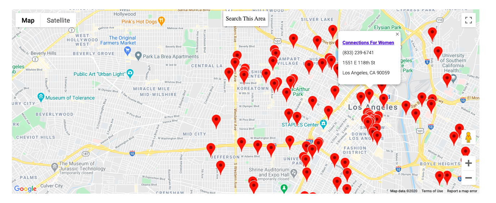

## FoodCycle Map
This is a basic setup for pulling data from the [FoodOasis](https://foodoasis.la/) API
and displaying it on GoogleMaps using their Maps JavaScript API. It contains information
about food pantries and meal programs in the Los Angeles area for people dealing with food insecurity.
As the user drags the map around, they have the ability to "Search This Area" to find locations in
their area of interest. The map's initial location defaults to Los Angeles city center.



## Set-Up
To get this map running you will need to create a billing account with Google Maps Platform and
create an API key, see [here](https://developers.google.com/maps/documentation/javascript/get-api-key).
You will then need to include the API key in the `index.html` script tag.

```<script async defer src="https://maps.googleapis.com/maps/api/js?key=api-key-goes-here=initMap" type="text/javascript"></script>```